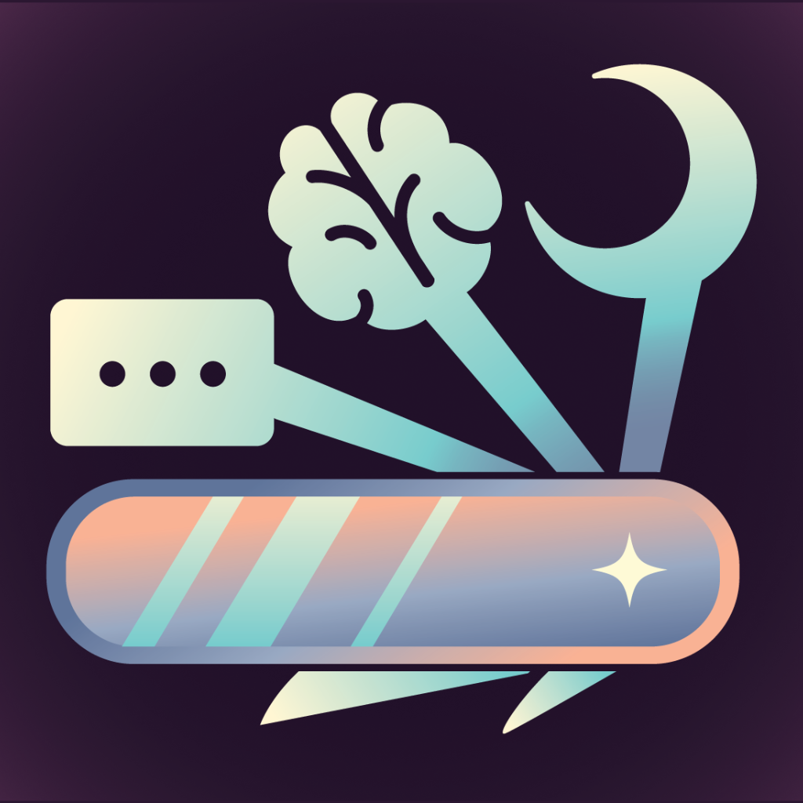

<p align="center">
  
</p>

<h1 align="center">Inoxity for iPhone</h1>

<p align="center"><em>Durable by design. Open by nature. Driven by curiosity.</em></p>

## Hey there!

Welcome to Inoxity, an open-source research platform for running iPhone studies in people's everyday lives. Inoxity combines Apple Health data (including data from Apple Watch), scheduled surveys and EMA, reminders, and optional photo and video uploads, all configured without writing code.

Each study's participant data goes to a Supabase project that the research team owns and controls. Inoxity never holds it.

This repository is the **participant iPhone app**. Research teams set up their studies in the [Researcher Dashboard](https://github.com/inoxity/inoxity-dashboard) at [inoxity.org](https://www.inoxity.org). Participants then join by entering the study's code in this app.

> **Status:** Inoxity is undergoing active development and large-scale validation, and will be ready for use soon. [Join the mailing list](https://www.inoxity.org/updates) to hear when it launches, or email Rachael Kee at [rlkee@ucdavis.edu](mailto:rlkee@ucdavis.edu) for early access.

What's in this repo:
1. **The Inoxity iOS app** (SwiftUI, iOS 17 and later). A participant enters a study code, and the app shows only what that study turned on:
   - onboarding and a participant ID
   - Apple Health and notification permissions
   - scheduled surveys and reminders
   - photo and video uploads
   - a private **See My Data** summary
   - withdrawal

   Data goes straight to the study's own backend, never through Inoxity.
2. **Tests**: an XCTest suite covering configuration, enrollment, Apple Health sync, notifications, surveys, media, and withdrawal.
3. **Backend templates** in [`supabase/`](supabase/): migrations for the shared Control Backend, and the reference Study Backend template that the dashboard's generated setup files are built from.

---

### Start from Here

New to Inoxity? Start with the documentation:

- [Before you start](https://inoxity.readthedocs.io/en/latest/getting-started/before-you-start/): what you'll need and what to plan before your first study.
- [What participants experience](https://inoxity.readthedocs.io/en/latest/participant-experience/onboarding/): onboarding, See My Data, and withdrawal.
- [FAQ](https://inoxity.readthedocs.io/en/latest/faq/) and [Troubleshooting](https://inoxity.readthedocs.io/en/latest/troubleshooting/), including the enrollment error codes the app shows.

---

### For Developers

1. Open `Inoxity.xcodeproj` in Xcode.
2. Copy `Config/Secrets.example.xcconfig` to `Config/Secrets.local.xcconfig` and fill in the Control Backend URL and anon key. That file is git-ignored.
3. Pick the scheme that matches the study's Data Backend environment. Real studies use **Inoxity-Production**, the same as TestFlight and App Store builds.

Use a physical iPhone to test Apple Health and notifications. To run the tests on a Simulator from the command line:

```bash
xcodebuild test -project Inoxity.xcodeproj -scheme Inoxity-Development \
  -destination 'platform=iOS Simulator,id=<simulator id>' ARCHS=arm64 ONLY_ACTIVE_ARCH=YES
```

---

### License

Copyright (c) 2026, Rachael Kee and Laasya Madgula. This project is licensed under the [BSD 3-Clause License](LICENSE). See the [LICENSE](LICENSE) file for full terms.

---

### Acknowledgements

Inoxity was created by **Rachael Kee** (lead developer) with **Laasya Madgula**, in the [Cognitive Communication Science Lab](https://cogcommscience.ucdavis.edu/people) at UC Davis, led by **Richard Huskey**. See [About the team](https://inoxity.readthedocs.io/en/latest/about/).

We're grateful to the following people for their help with Inoxity's development and validation:

- **Emorie Beck**, Associate Professor, Department of Psychology, University of California, Davis
- **Allison Eden**, Associate Professor, Department of Communication, Michigan State University
- **Morgan Ellithorpe**, Associate Professor, Department of Communication, University of Delaware
- **Ian Kim**, Assistant Professor, School of Kinesiology, University of Michigan
- **Aaron Luellen**, Independent web developer

---

### Contact

For questions about using Inoxity, early access, or collaboration, please contact:
**Rachael Kee**: [rlkee@ucdavis.edu](mailto:rlkee@ucdavis.edu)

For support with a running study: [inoxity.team@gmail.com](mailto:inoxity.team@gmail.com)
